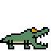

# Werkplaats 1: PyGame

<ol>
    <li><a href="#concept">Concept</a></li>
    <li><a href="#doel">Doel</a></li>
    <li><a href="#vijanden">Vijanden</a></li>
    <li><a href="#game-over">Game Over</a></li>
    <li><a href="#controls">Controls</a></li>
    <li>
      <a href="#installatie">Installatie</a>
      <ul>
        <li><a href="#command-line">Command Line</a></li>
      </ul>
    </li>
    <li>
      <a href="#bronnenlijst">Bronnenlijst</a>
      <ul>
        <li><a href="#tekst">Tekst</a></li>
        <li><a href="#video">Video</a></li>
      </ul>
    </li>
</ol>

### Concept
De opdracht was het maken van een game in Python met behulp van Pygame.
We hebben een spel gemaakt waar de speler controle krijgt over een gorilla.
De gorilla wordt belaagd door verschillende dieren.


### Doel
Het doel van het spel is om zo lang mogelijk te overleven en zo veel mogelijk vijanden te verslaan.
De speler verdient op twee manieren punten:

- Het verslaan van vijanden. Voor elke vijand die de speler verslaat krijgt de speler een aantal punten.
- Zo lang mogelijk overleven.


### Vijanden
De speler wordt door verschillende soorten vijanden aangevallen.
Als de speler wordt geraakt verliest de speler een van zijn drie hartjes.
Deze vijanden nemen de vorm aan van verschillende dieren.

- Toucan: 
- Alligator: 
- Penguin:  
- Sneeuwpop: 

### Game Over
Wanneer de speler al zijn levens is verloren eindigt het spel.
Op het Game Over scherm staat uiteindelijke score van de speler en of deze score de high score verslaat.
De speler kan in dit menu opnieuw beginnen en het spel beëindigen.


### Controls


# Installatie

### Commandline:
```python
git clone "HTTPS/SSH Link"
```

```python
pip install -r requirements.txt
```

Voeg een python interpreter toe en voer de volgende file uit:

```python
game.py
```

# Bronnenlijst

### Tekst
- https://dev.to/annlin/build-a-cool-thing-street-fighter-website-16j
- https://gamedev.stackexchange.com/questions/106457/move-an-enemy-towards-the-player-in-pygame
- https://medium.com/@amit25173/pygame-fonts-guide-for-beginners-e2ec8bf7671c
- https://pixabay.com/sound-effects/8-bit-heaven-26287/
- https://stackoverflow.com/questions/9961563/how-can-i-make-a-sprite-move-when-a-key-is-held-down
- https://stackoverflow.com/questions/4183208/how-do-i-rotate-an-image-around-its-center-using-pygame
- https://stackoverflow.com/questions/20023709/resetting-pygames-timer
- https://stackoverflow.com/questions/31169094/why-does-my-simple-pygame-lag
- https://www.deviantart.com/midgptjourney/art/lush-jungle-pixelart-escape-958673264
- https://www.geeksforgeeks.org/pygame-flip-the-image/
- https://www.megavoxels.com/learn/how-to-make-a-pixel-art-banana/
- https://www.megavoxels.com/learn/how-to-make-a-pixel-art-coconut/
- https://www.megavoxels.com/learn/how-to-make-a-pixel-art-orange/
- https://www.reddit.com/r/pygame/comments/174z9i2/how_to_shoot_projectiles_in_pygame/

### Video
- https://www.youtube.com/watch?v=37phHwLtaFg
- https://www.youtube.com/watch?v=d06aVDzOfV8
- https://www.youtube.com/watch?v=GMBqjxcKogA
- https://www.youtube.com/watch?v=hM3dL5XEk5E
- https://www.youtube.com/watch?v=QS5OnNO8WR4
- https://www.youtube.com/watch?v=y9VG3Pztok8
